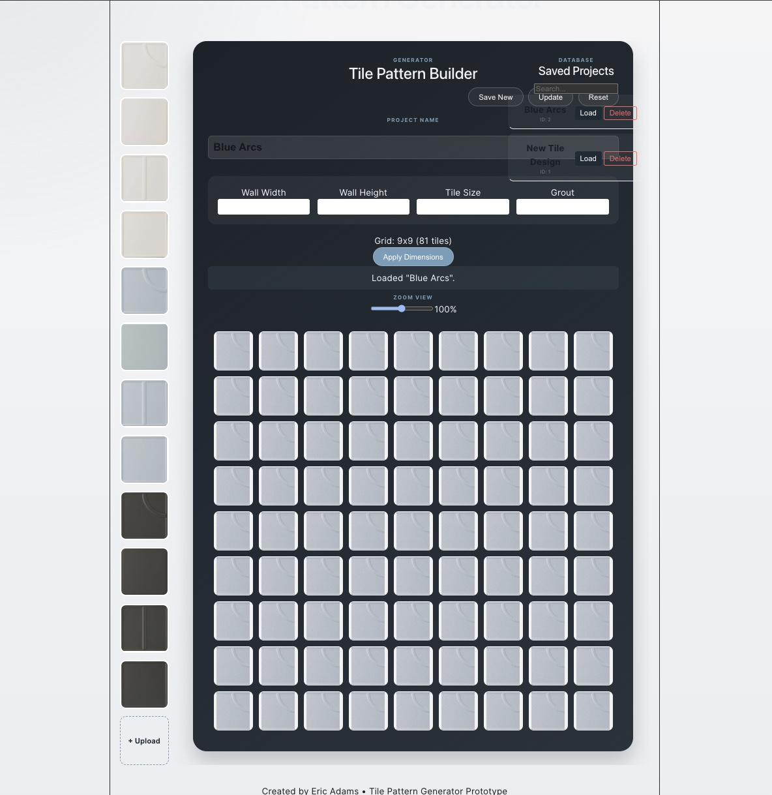
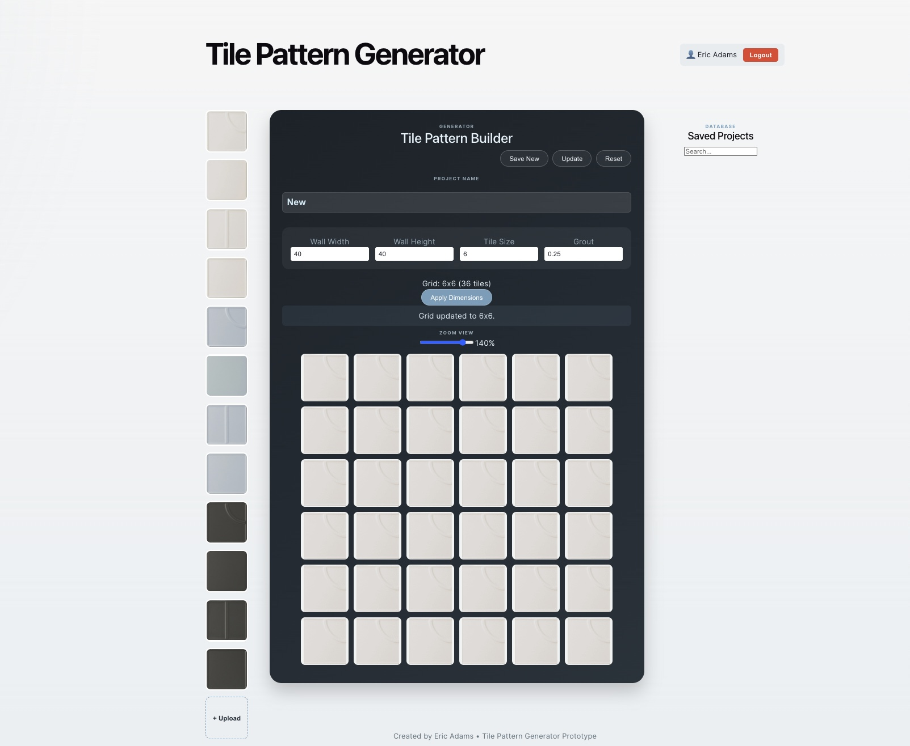

# Tile Pattern Generator

An interactive tile layout tool that allows users to design and preview tile patterns in real time.

**Live Demo:** Coming soon

---

## Features

- Click-to-place tile system  
- Drag-to-paint multiple tiles  
- Tile rotation support  
- Dynamic tile library  
- Upload custom tile images  
- Dynamic wall dimension controls  
- Adjustable zoom system  
- Responsive layout behavior  
- Saved project interface prototype  
- Real-time tile preview rendering  

---

## Tech Stack

- React (Vite)  
- JavaScript  
- CSS  
- Node.js  
- Express  
- MySQL  

---

## Project Status

Frontend prototype and UI system complete.

Current development includes:

- Responsive layout improvements  
- Dynamic scaling and zoom behavior  
- Layout persistence preparation  
- Backend/database integration  
- Authentication workflow integration  

Next step: complete full-stack implementation with persistent project saving and user accounts.

---

## Future Enhancements

- Save/load patterns (database)  
- Grout color visualization  
- Mobile-first UI improvements  
- AR-style tile preview  
- Pattern export system  
- Material usage calculations  
- Advanced layout templates  

---

## Progress Screenshots

### Early UI Prototype

Basic tile preview component used to establish the early layout structure.

---

### Interactive Grid System

Expanded into an interactive grid system with tile placement, rotation, and layout controls.

---

### Previous UI State

Earlier application layout featuring the initial grid system and tile management workflow.

---

### Latest UI Revision

Updated interface featuring improved responsive scaling behavior, enhanced typography contrast, footer positioning fixes, zoom controls, project naming workflow improvements, and refined tile layout rendering.

---

## Author

Eric Adams
