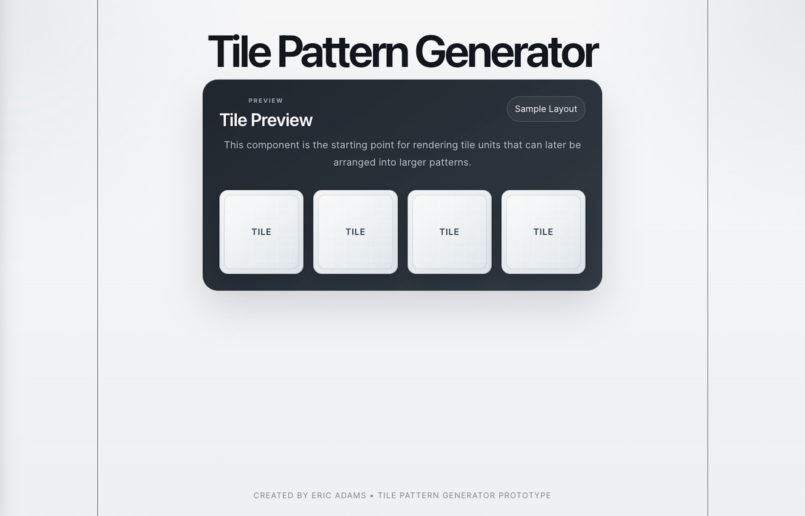
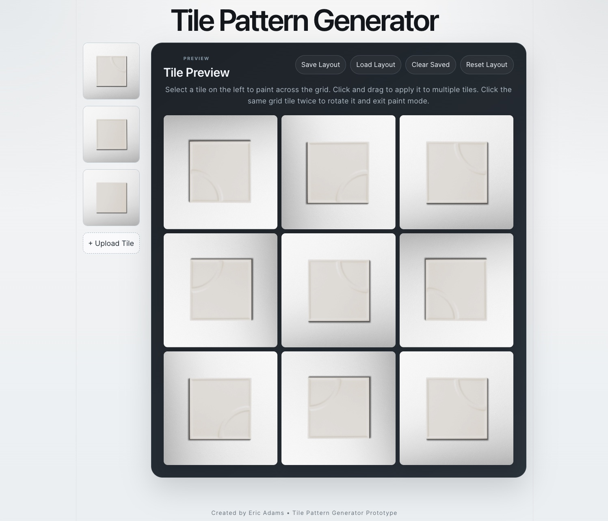

# Tile Pattern Generator

An interactive tile layout tool that allows users to design and preview tile patterns in real time.

**Live Demo:** Coming soon

---

## Features

- Click-to-place tile system
- Drag-to-paint multiple tiles
- Tile rotation support
- Dynamic tile library
- Upload custom tile images

## Tech Stack

- React (Vite)
- JavaScript
- CSS

## Project Status

Frontend MVP complete.  
Next step: full-stack implementation with backend, authentication, and pattern persistence.

## Future Enhancements

- Save/load patterns (database)
- Grout color visualization
- Mobile-first UI improvements
- AR-style tile preview

## Progress Screenshots

### Initial Prototype

Basic tile preview component used to establish the early layout structure.

---

### Interactive Grid Version

Expanded into an interactive grid system with tile placement, rotation, and layout controls.

## Author

Eric Adams
