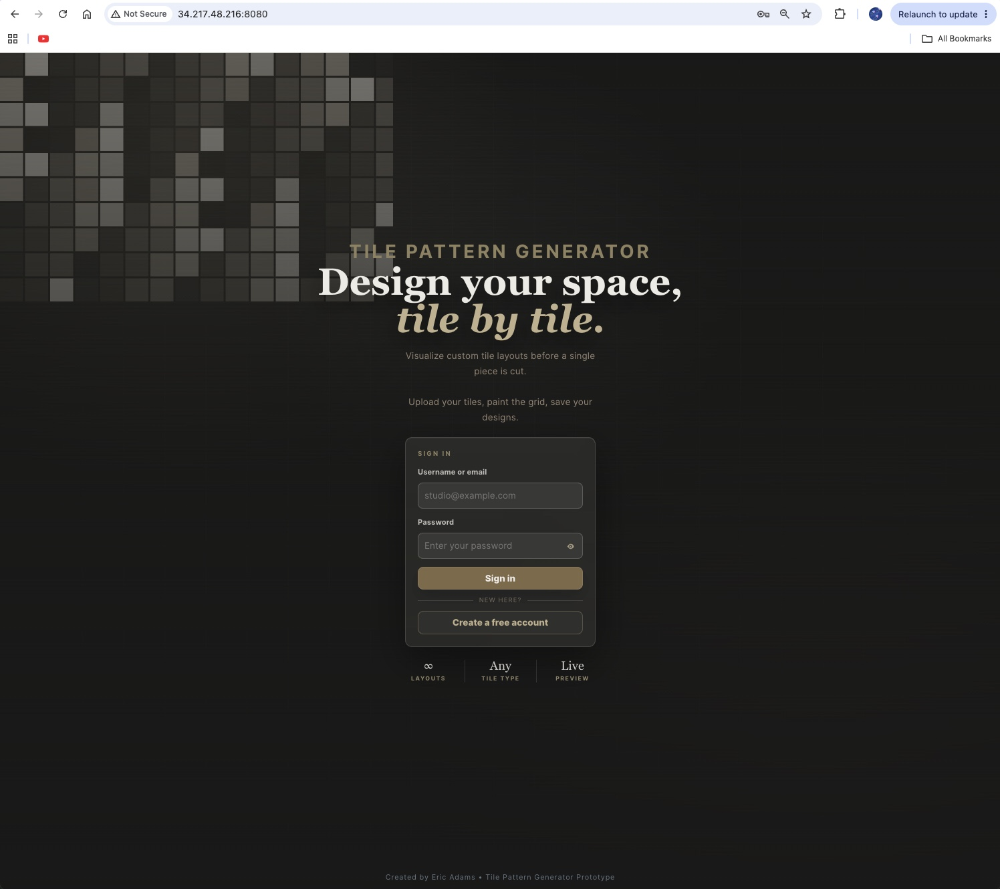
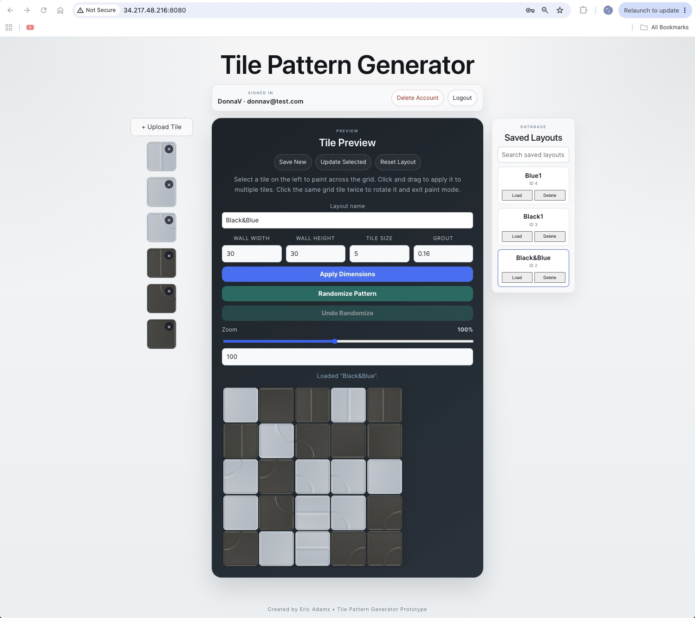
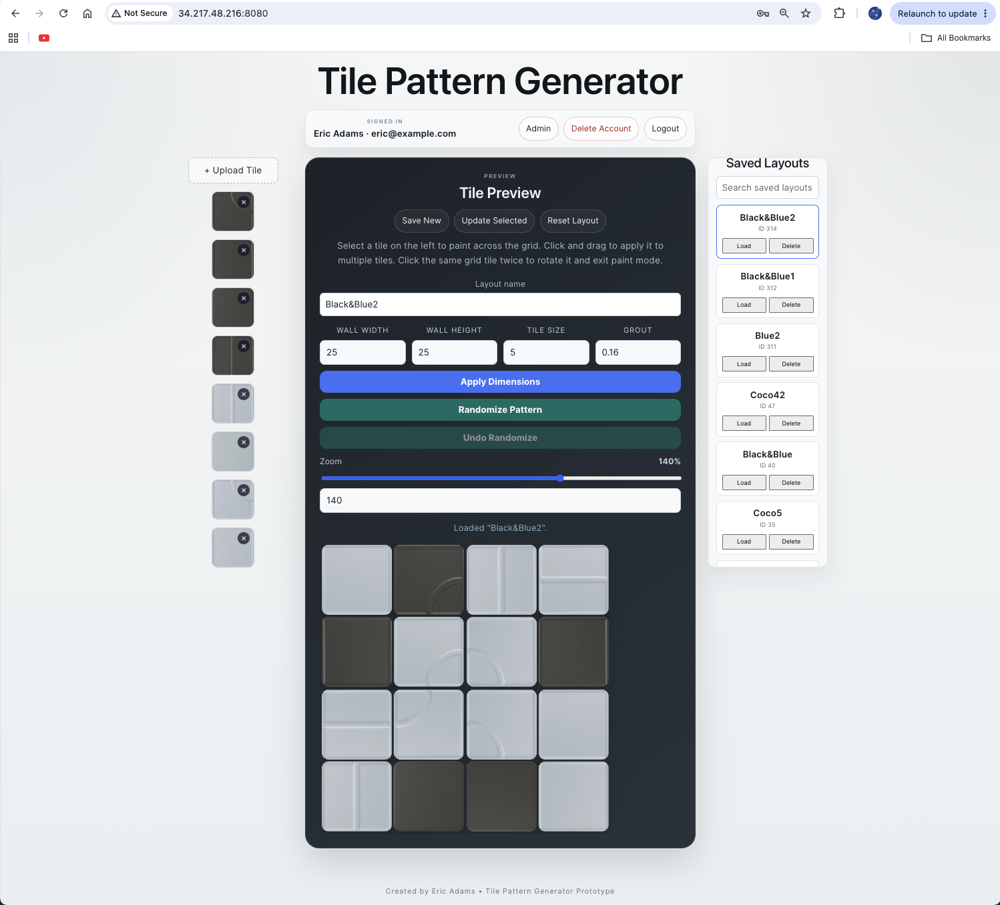
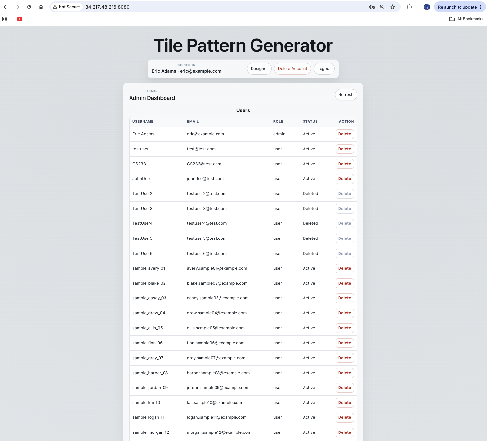
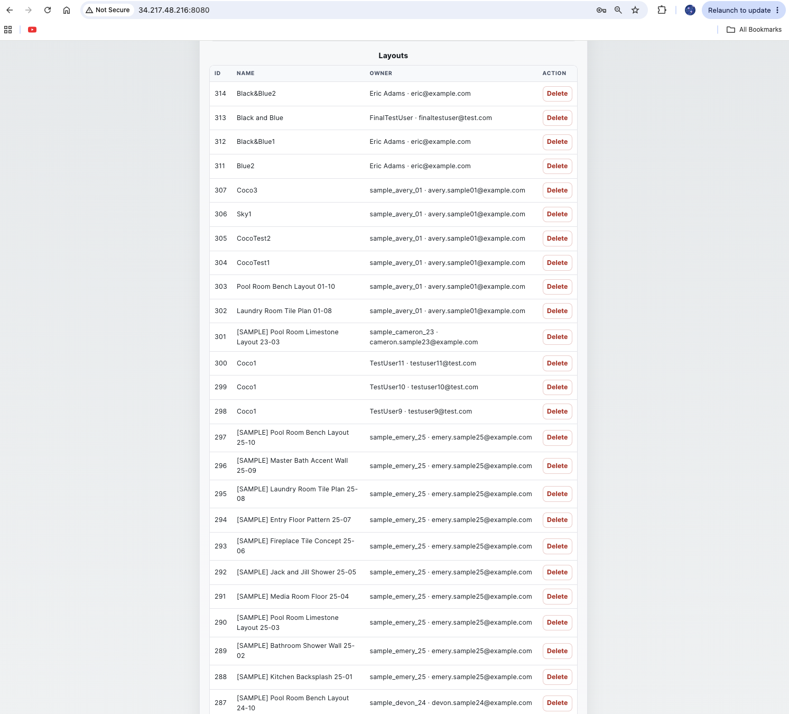

# Tile Pattern Generator

Design your space, tile by tile.



Tile Pattern Generator is a full-stack web application that allows users to upload custom tile images, design layouts interactively, save projects, and generate randomized tile patterns before installation.

Originally developed as a software development course project at Olympic College, the application evolved into a production-style prototype featuring authentication, role-based administration, persistent file storage, automated testing, continuous integration, and deployment to Amazon Web Services (AWS).

The goal of the project is to help users visualize tile layouts before installation, reducing material waste and improving design confidence.

---

## Tile Designer

Authenticated users can upload custom tile images, create layouts, save designs, randomize patterns, and revisit projects through persistent storage.



---

## Features

### Designer Features

- User registration and authentication
- Persistent login sessions
- Upload custom tile images
- Interactive tile painting
- Tile rotation
- Adjustable wall dimensions
- Adjustable tile sizing
- Grout spacing controls
- Zoom controls
- Save new layouts
- Update existing layouts
- Search saved layouts
- Randomize tile patterns
- Undo randomization
- Persistent layout storage

### Administrative Features

- Role-based authorization
- Administrator dashboard
- User management
- Layout management
- Soft delete functionality
- Protected administrative endpoints

---

## Administrative Dashboard

Role-based administration provides authorized users with access to management tools and system oversight.



---

## User Management

Administrators can manage application users through a dedicated dashboard supporting role-based access control.



---

## Layout Administration

Administrative layout management enables moderation and oversight of user-generated content.



---

## Technology Stack

### Frontend

- React
- Vite
- JavaScript
- CSS

### Backend

- Node.js
- Express

### Database

- MariaDB / MySQL

### Infrastructure

- Amazon Web Services (AWS EC2)
- PM2 Process Manager

### Testing & Quality

- Vitest
- GitHub Actions
- ESLint

---

## Architecture

```text
Browser
   ↓
React Frontend
   ↓
Express API
   ↓
MariaDB Database
   ↓
Persistent Upload Storage
```

---

## Deployment

The application is deployed to AWS using an EC2 instance running:

- Node.js backend services
- PM2 process management
- MariaDB database services
- Persistent file upload storage

The deployment process included:

- Database migrations
- Production data restoration
- Legacy account migration
- Asset recovery
- Environment configuration
- Production verification testing

A complete end-to-end migration was performed from the local development environment to AWS production, including database export/import, MariaDB compatibility conversion, user restoration, uploaded asset recovery, and validation of persistent application functionality.

---

## Supporting Documentation

Additional project artifacts are included within this repository:

- `SECURITY_DEMO.md`
- `BENCHMARK_DEMO.md`
- `SAMPLE_DATA_DEMO.md`
- `ADMIN_USERS_DEMO.md`

These documents demonstrate the security enhancements, performance testing, administrative functionality, and sample data generation completed throughout development.

---

## Future Enhancements

Potential future improvements include:

- Responsive mobile designer experience
- HTTPS and custom domain configuration
- Password reset functionality
- Email verification
- PDF layout exports
- Material quantity estimation
- Drag-and-drop tile organization
- Enhanced reporting and analytics

---

## Live Demo

Current deployment subject to change:

[Open Live Demo](http://34.217.48.216:8080)

---

## About This Project

This project demonstrates:

- Full-stack application development
- Authentication and authorization
- Secure file upload management
- Database persistence
- Automated testing practices
- Continuous integration workflows
- AWS cloud deployment
- PM2 process management
- Production data migration
- Recovery of user-generated assets
- Real-world debugging and operational problem solving

---

Created by **Eric Adams** as part of the **Olympic College Software Development Program**.

What began as a classroom assignment evolved into a deployed, production-style application capable of supporting authenticated users, administrative workflows, persistent storage, and cloud-hosted operation.
